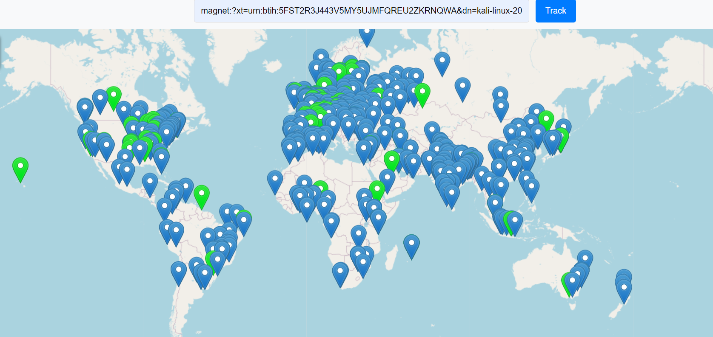

# 🌐 Torrent Map Tracker

Welcome to the Torrent Map Tracker repository! This project is dedicated to tracking and visualizing the geolocation of peers in a torrent swarm.

## 🚀 Features

- **Real-Time Tracking**: Track peers in real-time with Flask-SocketIO.
- **Geolocation Visualization**: See the geographical location of peers.
- **Interactive UI**: Easy to use web interface for tracking torrents.

📸 Example image
- These are all the Kali torrenters in the last 24 hours who didn't use a VPN. Green means they have an open webserver port on one of these ports "8080,80,8888,443,1337,9000,420"
<p align="center">
  
</p>

## 🛠 Installation

### IMPORTANT!!!!

You will need this file
- https://download.db-ip.com/free/dbip-city-lite-2023-12.csv.gz
This file is formatted like so:

| Start IP  | End IP        | Continent | Country | State     | City                | Latitude | Longitude |
|-----------|---------------|-----------|---------|-----------|---------------------|----------|-----------|
| 1.0.16.0  | 1.0.16.255    | AS        | JP      | Tokyo     | Chiyoda             | 35.6916  | 139.768   |
| 1.0.17.0  | 1.0.31.255    | AS        | JP      | Tokyo     | Shinjuku (1-chōme)  | 35.6944  | 139.703   |
| 1.0.32.0  | 1.0.63.255    | AS        | CN      | Guangdong | Xiaolou             | 23.379   | 113.763   |

- In the future, adjusting co-ords instead of just subnets, can provide more accurate information.


1. Clone the repository:
```bash
git clone https://github.com/pentestfunctions/torrent-map-tracker.git
```

2. Navigate into the project folder:
```bash
cd torrent-map-tracker
```

3. Install dependencies:
```bash
pip install -r requirements.txt
```

## ⚙️ Usage

To start the tracker, run the following command:
```bash
go install -v github.com/projectdiscovery/httpx/cmd/httpx@latest
python app.py
```

Visit `http://localhost:5000` in your web browser to view the tracker interface.

- Notes:
  If you need, convert a .torrent file to magnet using https://nutbread.github.io/t2m/

## 🧰 Built With

- [Flask](https://flask.palletsprojects.com/) - Web framework
- [Flask-SocketIO](https://flask-socketio.readthedocs.io/) - Real-time communication
- [Libtorrent](https://www.libtorrent.org/) - BitTorrent library
- [Flask-CORS](https://flask-cors.readthedocs.io/) - Handling Cross-Origin Resource Sharing (CORS)

## 📚 Documentation

- Only nerds need documentation.

💖 Thank you for visiting my repository!


